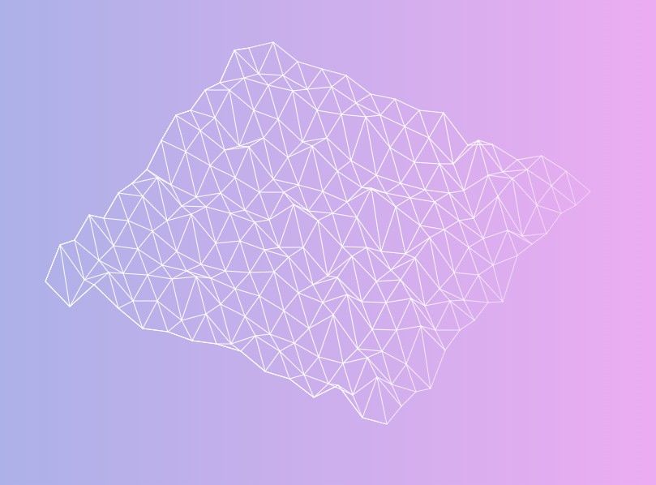

# Perlin Terrain Animation

An animated 3D wireframe terrain that scrolls endlessly toward the viewer, rendered entirely in the browser with no dependencies.

<p align="center">
  
</p>

## How It Works

A 15×15 grid of 3D points is generated using **simplex noise** to set each point's height (Z-axis). Every frame the grid scrolls forward — when a row scrolls off the front, a new procedurally-generated row is appended at the back, creating infinite terrain.

The scene is transformed each frame in order:

1. **Scroll** — rows shift along Y
2. **Rotate Z** — slow continuous drift (~0.05° per frame)
3. **Tilt X** — fixed 45° isometric-style perspective
4. **Project** — orthographic flatten to 2D canvas

Lines are drawn as white triangles with a linear gradient fade toward the edges.

## Files

| File | Purpose |
|------|---------|
| [index.html](index.html) | Canvas element, script loading |
| [main.js](main.js) | Grid generation, animation loop, transforms |
| [perlin.js](perlin.js) | Simplex 2D/3D & Perlin 2D/3D noise (public domain) |
| [base.css](base.css) | Full-screen canvas, blue-to-pink gradient background |

## Running

Open `index.html` directly in any modern browser — no build step, no server required.

```
open index.html
```

The animation targets **240 FPS** via `setInterval`.

## Tech

- Vanilla JavaScript (ES6 classes)
- HTML5 Canvas 2D API
- CSS3 linear-gradient background
- Simplex noise by Stefan Gustavson (public domain)

## License

Noise algorithm (`perlin.js`) is public domain per Stefan Gustavson.  
Everything else — no license specified.
